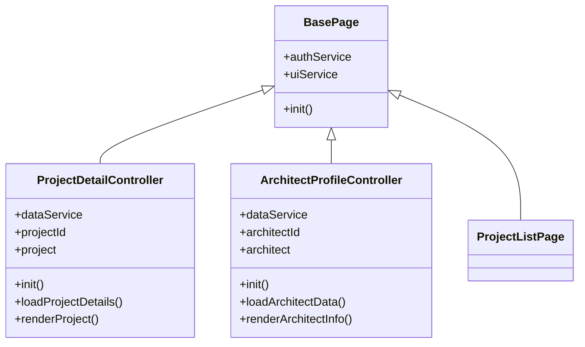
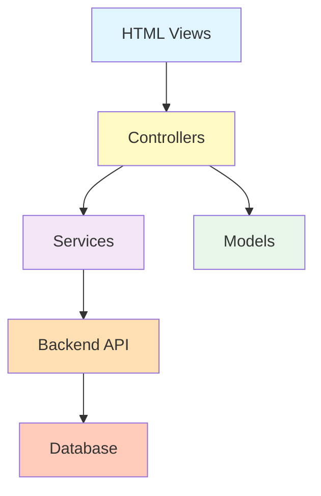
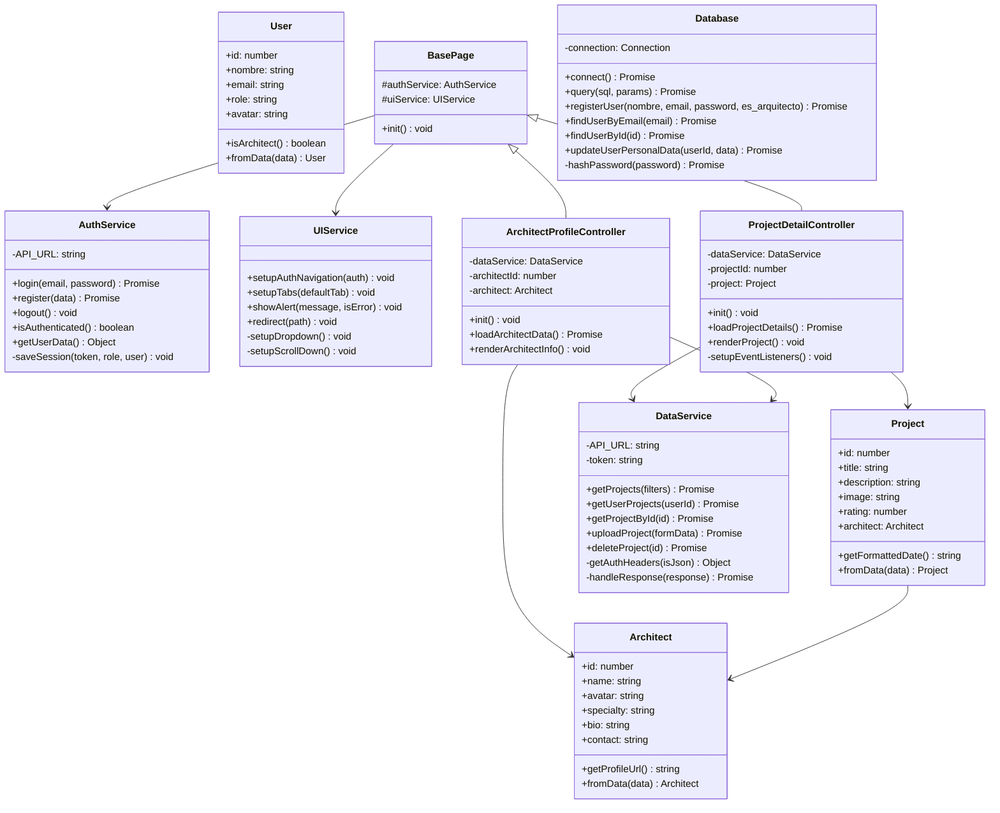
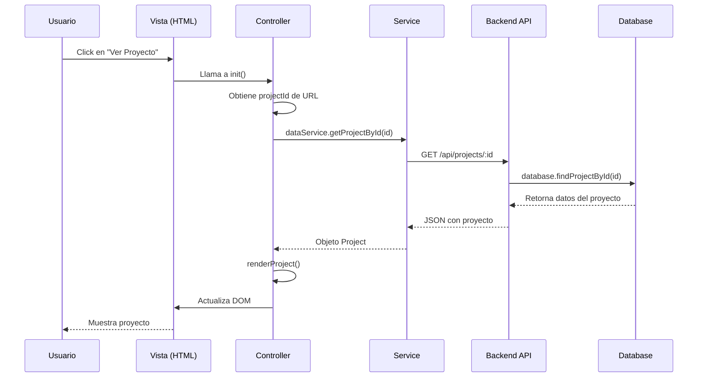

# 📚 Guía de Programación Orientada a Objetos - PortArq

## 📖 Índice
1. [Introducción](#introducción)
2. [Los 4 Pilares de POO](#los-4-pilares-de-poo)
   - [Encapsulación](#1-encapsulación)
   - [Abstracción](#2-abstracción)
   - [Herencia](#3-herencia)
   - [Polimorfismo](#4-polimorfismo)
3. [Arquitectura del Proyecto](#arquitectura-del-proyecto)
4. [Patrones de Diseño Utilizados](#patrones-de-diseño-utilizados)
5. [Diagramas de Clases](#diagramas-de-clases)

---

## Introducción

Este proyecto **PortArq** (Plataforma de Arquitectos) está construido siguiendo los principios de **Programación Orientada a Objetos (POO)**. La arquitectura está organizada en capas claramente definidas:

- **Modelos** (`JS/models/`): Representan las entidades del dominio
- **Servicios** (`JS/services/`): Encapsulan la lógica de negocio y comunicación con APIs
- **Controladores** (`JS/controllers/`): Coordinan la interacción entre modelos, servicios y vistas
- **Backend** (`src/`, `database.js`): Gestiona la persistencia y lógica del servidor

---

## Los 4 Pilares de POO

### 1. Encapsulación

> **Definición**: Ocultar los detalles internos de implementación y exponer solo lo necesario mediante una interfaz pública.

#### 🎯 Ejemplo en el Proyecto: Clase `AuthService`

**Archivo**: [`JS/services/AuthService.js`](file:///c:/Users/jmaci/Trabajo-Boyain/JS/services/AuthService.js)

```javascript
export class AuthService {
    constructor() {
        // ✅ Propiedad privada (por convención)
        this.API_URL = 'http://localhost:3000/api';
    }

    // ✅ Método público - interfaz expuesta
    async login(email, password) {
        console.log(`[AuthService] Intentando login para: ${email}`);
        
        const response = await fetch(`${this.API_URL}/login`, {
            method: 'POST',
            headers: { 'Content-Type': 'application/json' },
            body: JSON.stringify({ email, password })
        });

        const result = await response.json();
        
        if (!response.ok) {
            throw new Error(result.error || 'Fallo en el inicio de sesión.');
        }

        const user = result.user;
        const role = user.es_arquitecto ? 'arquitecto' : 'cliente';
        
        // ✅ Llama a un método privado interno
        this.saveSession(result.token, role, user);
        return { token: result.token, user, role };
    }

    // ✅ Método privado (por convención) - detalles de implementación ocultos
    saveSession(token, role, user) {
        localStorage.setItem('authToken', token);
        localStorage.setItem('userRole', role);
        localStorage.setItem('userName', user.nombre);
        localStorage.setItem('userId', user.id);
        localStorage.setItem('userData', JSON.stringify(user));
    }
}
```

**Beneficios**:
- El usuario de la clase solo necesita llamar `login()` sin preocuparse de cómo se guarda la sesión
- Los detalles de `localStorage` están encapsulados en `saveSession()`
- Si cambiamos el mecanismo de almacenamiento (ej. cookies), solo modificamos `saveSession()`

---

### 2. Abstracción

> **Definición**: Simplificar la complejidad mostrando solo las características esenciales y ocultando los detalles innecesarios.

#### 🎯 Ejemplo en el Proyecto: Clase Base `BasePage`

**Archivo**: [`JS/controllers/BasePage.js`](file:///c:/Users/jmaci/Trabajo-Boyain/JS/controllers/BasePage.js)

```javascript
/**
 * Clase base para controladores de página.
 * Proporciona funcionalidad común para todos los controladores.
 */
export class BasePage {
    constructor(authService, uiService) {
        this.authService = authService;
        this.uiService = uiService;
    }

    /**
     * Método de inicialización que debe ser sobrescrito por las clases hijas.
     */
    async init() {
        throw new Error('El método init() debe ser implementado por la clase hija');
    }
}
```

**Uso en Controladores Concretos**:

```javascript
// JS/controllers/ProjectDetailController.js
export class ProjectDetailController extends BasePage {
    constructor(authService, uiService, dataService) {
        super(authService, uiService); // ✅ Reutiliza la abstracción
        this.dataService = dataService;
        this.projectId = this.getProjectIdFromURL();
        this.project = null;
    }

    // ✅ Implementación concreta del método abstracto
    async init() {
        console.log(`✨ ProjectDetailController: Inicializando para ID: ${this.projectId}`);
        
        if (!this.projectId) {
            this.uiService.showAlert('ID de proyecto no encontrado en la URL.', true);
            this.uiService.redirect('Proyectos.html');
            return;
        }

        await this.loadProjectDetails();
        this.setupFileTabs();
        this.setupEventListeners();
    }
}
```

**Beneficios**:
- Define un **contrato** que todos los controladores deben cumplir
- Evita duplicación de código (servicios compartidos)
- Facilita el mantenimiento y testing

---

### 3. Herencia

> **Definición**: Permite crear nuevas clases basadas en clases existentes, heredando sus propiedades y métodos.

#### 🎯 Ejemplo en el Proyecto: Jerarquía de Controladores

**Diagrama de Herencia**:



**Código Real**:

```javascript
// Clase Padre
export class BasePage {
    constructor(authService, uiService) {
        this.authService = authService; // ✅ Heredado por todas las clases hijas
        this.uiService = uiService;      // ✅ Heredado por todas las clases hijas
    }
}

// Clase Hija 1
export class ProjectDetailController extends BasePage {
    constructor(authService, uiService, dataService) {
        super(authService, uiService); // ✅ Llama al constructor del padre
        this.dataService = dataService; // ✅ Propiedad específica
    }
}

// Clase Hija 2
export class ArchitectProfileController extends BasePage {
    constructor(authService, uiService, dataService) {
        super(authService, uiService); // ✅ Llama al constructor del padre
        this.dataService = dataService; // ✅ Propiedad específica
        this.architectId = this.getArchitectIdFromURL(); // ✅ Método específico
    }
}
```

**Beneficios**:
- Reutilización de código (no repetimos `authService` y `uiService` en cada controlador)
- Jerarquía clara y mantenible
- Fácil agregar nuevos controladores

---

### 4. Polimorfismo

> **Definición**: Capacidad de objetos de diferentes clases de responder al mismo método de manera diferente.

#### 🎯 Ejemplo en el Proyecto: Método `init()` Polimórfico

Cada controlador implementa `init()` de manera diferente según sus necesidades:

```javascript
// ✅ ProjectDetailController.init()
export class ProjectDetailController extends BasePage {
    async init() {
        console.log(`✨ ProjectDetailController: Inicializando para ID: ${this.projectId}`);
        
        if (!this.projectId) {
            this.uiService.showAlert('ID de proyecto no encontrado en la URL.', true);
            this.uiService.redirect('Proyectos.html');
            return;
        }

        await this.loadProjectDetails();
        this.setupFileTabs();
        this.setupEventListeners();
        
        this.favoritesController.initDetail(this.projectId);
        this.ratingController.init(this.projectId);
    }
}

// ✅ ArchitectProfileController.init()
export class ArchitectProfileController extends BasePage {
    init() {
        console.log(`✨ ArchitectProfileController: Inicializando para ID: ${this.architectId}`);
        this.loadArchitectData();
    }
}
```

**Polimorfismo en Acción**:

```javascript
// Código genérico que funciona con cualquier controlador
function initializePage(controller) {
    controller.init(); // ✅ Llama al método correcto según el tipo de controlador
}

// Funciona con cualquier controlador que herede de BasePage
const projectController = new ProjectDetailController(auth, ui, data);
const architectController = new ArchitectProfileController(auth, ui, data);

initializePage(projectController);   // Ejecuta init() de ProjectDetailController
initializePage(architectController);  // Ejecuta init() de ArchitectProfileController
```

#### 🎯 Otro Ejemplo: Método `fromData()` en Modelos

**Archivo**: [`JS/models/User.js`](file:///c:/Users/jmaci/Trabajo-Boyain/JS/models/User.js)

```javascript
export class User {
    constructor(data) {
        this.id = data.id || null;
        this.nombre = data.nombre || 'Usuario Anónimo';
        this.email = data.email || '';
        this.role = data.es_arquitecto ? 'arquitecto' : 'cliente';
    }

    // ✅ Método estático polimórfico
    static fromData(data) {
        return new User(data);
    }
}

export class Architect {
    constructor(data) {
        this.id = data.id;
        this.name = data.nombre || 'Arquitecto';
        this.avatar = data.avatar || 'https://placehold.co/150x150/333/fff?text=A';
        this.specialty = data.especialidad || 'Arquitectura General';
    }

    // ✅ Mismo nombre de método, diferente implementación
    static fromData(data) {
        return new Architect(data);
    }
}

export class Project {
    constructor(data) {
        this.id = data.id;
        this.title = data.titulo || 'Proyecto sin título';
        this.description = data.descripcion || 'Sin descripción breve.';
    }

    // ✅ Mismo nombre de método, diferente implementación
    static fromData(data) {
        return new Project(data);
    }
}
```

**Uso Polimórfico**:

```javascript
// ✅ Mismo método, diferentes resultados según el tipo
const user = User.fromData(apiResponse);
const architect = Architect.fromData(apiResponse);
const project = Project.fromData(apiResponse);
```

**Beneficios**:
- Interfaz uniforme para crear objetos
- Código más limpio y predecible
- Fácil de extender con nuevos modelos

---

## Arquitectura del Proyecto

### 📁 Estructura de Carpetas

```
Trabajo-Boyain/
├── JS/
│   ├── models/           # 🎨 Modelos de dominio
│   │   ├── User.js
│   │   ├── Architect.js
│   │   └── Project.js
│   ├── services/         # 🔧 Servicios de negocio
│   │   ├── AuthService.js
│   │   ├── DataService.js
│   │   └── UIService.js
│   └── controllers/      # 🎮 Controladores de página
│       ├── BasePage.js
│       ├── ProjectDetailController.js
│       ├── ArchitectProfileController.js
│       └── ...
├── src/                  # 🖥️ Backend (Node.js)
│   ├── Server.js
│   ├── controllers/
│   ├── routes/
│   └── middlewares/
└── database.js           # 💾 Gestión de Base de Datos
```

### 🏗️ Capas de la Aplicación



**Responsabilidades**:

1. **Views (HTML)**: Presentación visual
2. **Controllers**: Coordinación y lógica de UI
3. **Services**: Comunicación con APIs y lógica de negocio
4. **Models**: Representación de datos
5. **Backend API**: Endpoints REST
6. **Database**: Persistencia de datos

---

## Patrones de Diseño Utilizados

### 1. **Singleton Pattern** - Clase `Database`

**Archivo**: [`database.js`](file:///c:/Users/jmaci/Trabajo-Boyain/database.js)

```javascript
class Database {
    constructor() {
        this.connection = null; // ✅ Una única instancia de conexión
    }

    async connect() {
        try {
            this.connection = await mysql.createConnection({
                host: 'localhost',
                user: 'root',
                password: 'qwerty'
            });
            
            console.log('✅ Conectado a MySQL');
            await this.connection.execute('CREATE DATABASE IF NOT EXISTS plataforma_arquitectos');
            await this.connection.changeUser({ database: 'plataforma_arquitectos' });
            return this.connection;
        } catch (error) {
            console.error('❌ Error conectando a la BD:', error.message);
            throw error;
        }
    }

    async query(sql, params = []) {
        if (!this.connection) {
            await this.connect(); // ✅ Reutiliza la conexión existente
        }
        return await this.connection.execute(sql, params);
    }
}

// ✅ Exporta una única instancia (Singleton)
const database = new Database();
export default database;
```

**Beneficios**:
- Una única conexión a la base de datos
- Evita múltiples conexiones innecesarias
- Gestión centralizada de recursos

---

### 2. **Factory Pattern** - Método `fromData()`

Todos los modelos implementan un método estático `fromData()` que actúa como **Factory**:

```javascript
// ✅ Factory para crear instancias de manera uniforme
const user = User.fromData(apiResponse);
const project = Project.fromData(apiResponse);
const architect = Architect.fromData(apiResponse);
```

**Beneficios**:
- Creación de objetos estandarizada
- Validación centralizada
- Fácil de testear

---

### 3. **Service Layer Pattern**

Los servicios (`AuthService`, `DataService`, `UIService`) encapsulan toda la lógica de negocio:

```javascript
// ✅ Controlador delgado, servicio robusto
export class ProjectDetailController extends BasePage {
    async loadProjectDetails() {
        try {
            // ✅ Delega la lógica al servicio
            const response = await fetch(`/api/projects/${this.projectId}`);
            const data = await response.json();

            if (!response.ok) {
                this.uiService.showAlert('El proyecto solicitado no existe.', true);
                this.uiService.redirect('Proyectos.html');
                return;
            }

            this.project = data.project;
            this.renderProject();

        } catch (error) {
            console.error('Error cargando detalles del proyecto:', error);
            this.uiService.showAlert('Error al cargar la información del proyecto.', true);
        }
    }
}
```

**Beneficios**:
- Separación de responsabilidades
- Reutilización de lógica
- Fácil de testear

---

### 4. **Template Method Pattern** - Clase `BasePage`

La clase base define el esqueleto del algoritmo (`init()`), y las subclases implementan los pasos específicos:

```javascript
// ✅ Plantilla en la clase base
export class BasePage {
    async init() {
        throw new Error('El método init() debe ser implementado por la clase hija');
    }
}

// ✅ Implementación específica en cada controlador
export class ProjectDetailController extends BasePage {
    async init() {
        // Paso 1: Validar ID
        if (!this.projectId) {
            this.uiService.showAlert('ID de proyecto no encontrado en la URL.', true);
            this.uiService.redirect('Proyectos.html');
            return;
        }

        // Paso 2: Cargar datos
        await this.loadProjectDetails();
        
        // Paso 3: Configurar UI
        this.setupFileTabs();
        this.setupEventListeners();
        
        // Paso 4: Inicializar subcontroladores
        this.favoritesController.initDetail(this.projectId);
        this.ratingController.init(this.projectId);
    }
}
```

---

## Diagramas de Clases

### 📊 Diagrama Completo del Sistema



### 🔄 Flujo de Datos en una Petición



---

## 🎓 Resumen de Conceptos POO en el Proyecto

| Pilar | Ejemplo en el Proyecto | Beneficio |
|-------|------------------------|-----------|
| **Encapsulación** | `AuthService.saveSession()` es privado | Oculta detalles de implementación |
| **Abstracción** | `BasePage` define interfaz común | Simplifica el uso de controladores |
| **Herencia** | Todos los controladores heredan de `BasePage` | Reutilización de código |
| **Polimorfismo** | Cada controlador implementa `init()` diferente | Flexibilidad y extensibilidad |

---

## 📝 Buenas Prácticas Implementadas

1. ✅ **Separación de Responsabilidades**: Modelos, Servicios y Controladores tienen roles claros
2. ✅ **DRY (Don't Repeat Yourself)**: Código reutilizable en clases base y servicios
3. ✅ **Inyección de Dependencias**: Los controladores reciben servicios como parámetros
4. ✅ **Convenciones de Nomenclatura**: Nombres descriptivos y consistentes
5. ✅ **Documentación**: Comentarios JSDoc en métodos importantes
6. ✅ **Manejo de Errores**: Try-catch en operaciones asíncronas
7. ✅ **Validación de Datos**: Verificación de parámetros antes de procesarlos

---

## 🚀 Conclusión

Este proyecto demuestra una **arquitectura sólida basada en POO** que:

- Facilita el mantenimiento y escalabilidad
- Permite agregar nuevas funcionalidades sin romper el código existente
- Separa claramente las responsabilidades
- Sigue patrones de diseño reconocidos en la industria

**¡La POO no es solo teoría, es una herramienta práctica para construir software de calidad!** 🎉
