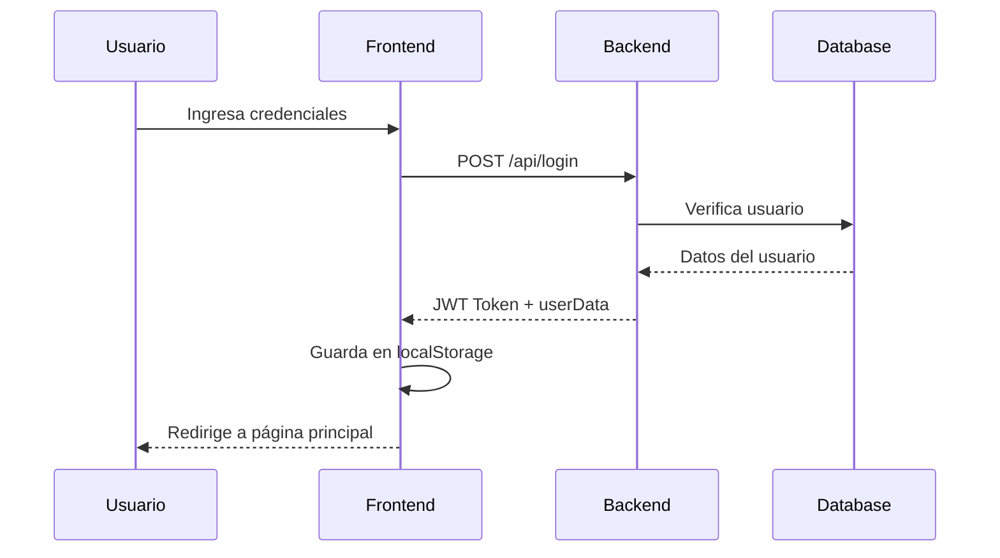

# 📋 Manual del Proyecto PortArq

**Fecha de actualización:** 24 de Noviembre, 2025  
**Versión:** 1.0  
**Equipo:** Frontend & Backend

---

## 📑 Índice

1. [Resumen del Proyecto](#resumen-del-proyecto)
2. [Arquitectura del Sistema](#arquitectura-del-sistema)
3. [Estado Actual - Lo que está hecho](#estado-actual---lo-que-está-hecho)
4. [Pendientes - Lo que falta por hacer](#pendientes---lo-que-falta-por-hacer)
5. [Puntos que necesitan revisión](#puntos-que-necesitan-revisión)
6. [Estructura de Archivos](#estructura-de-archivos)
7. [API Endpoints](#api-endpoints)
8. [Guía de Integración](#guía-de-integración)

---

## 🎯 Resumen del Proyecto

**PortArq** es una plataforma web para arquitectos que permite:
- Subir y gestionar proyectos arquitectónicos
- Explorar proyectos de otros arquitectos
- Sistema de favoritos y calificaciones
- Gestión de cuentas con roles (Arquitecto/Cliente)
- Suscripciones para arquitectos

### Tecnologías Utilizadas

**Frontend:**
- HTML5, CSS3, JavaScript (ES6+)
- Arquitectura modular con controladores OOP
- LocalStorage para gestión de sesión

**Backend:**
- Node.js + Express.js
- MySQL (base de datos)
- JWT para autenticación
- Multer para subida de archivos

---

## 🏗️ Arquitectura del Sistema

### Patrón de Diseño

El proyecto utiliza una arquitectura **MVC (Model-View-Controller)** con separación clara de responsabilidades:

```
Frontend (Cliente)
├── HTML (Views)
├── CSS (Estilos)
└── JS
    ├── controllers/ (Lógica de negocio)
    ├── services/ (Servicios compartidos)
    └── [página].js (Entry points)

Backend (Servidor)
├── src/
│   ├── controllers/ (Lógica de negocio)
│   ├── routes/ (Definición de rutas)
│   ├── middlewares/ (Autenticación, uploads)
│   └── Server.js (Configuración del servidor)
└── database.js (Conexión y operaciones DB)
```

### Flujo de Autenticación



---

## ✅ Estado Actual - Lo que está hecho

### 1. Sistema de Autenticación ✅

**Archivos:**
- `JS/services/AuthService.js`
- `src/routes/AuthRoutes.js`
- `src/controllers/AuthController.js`

**Funcionalidades:**
- ✅ Registro de usuarios (arquitectos y clientes)
- ✅ Login con email y contraseña
- ✅ Logout y limpieza de sesión
- ✅ Persistencia de sesión con JWT
- ✅ Verificación de roles (arquitecto/cliente)
- ✅ Middleware de autenticación (`AuthMiddleware.js`)

**Endpoints:**
```javascript
POST /api/register  // Registro de nuevo usuario
POST /api/login     // Inicio de sesión
```

**Datos almacenados en localStorage:**
```javascript
{
  authToken: "JWT_TOKEN",
  userRole: "arquitecto" | "cliente",
  userName: "Nombre del usuario",
  userId: "ID numérico",
  userData: {
    id, nombre, email, es_arquitecto, avatar, biografia, telefono, ubicacion
  }
}
```

---

### 2. Gestión de Proyectos ✅

**Archivos:**
- `src/routes/ProjectRoutes.js`
- `src/controllers/ProjectController.js`
- `JS/projectDetail.js`
- `JS/controllers/MisProyectosController.js`

**Funcionalidades:**
- ✅ Listar todos los proyectos públicos
- ✅ Ver detalle de un proyecto específico
- ✅ Crear nuevo proyecto (solo arquitectos)
- ✅ Actualizar proyecto propio
- ✅ Eliminar proyecto propio
- ✅ Subida de imágenes, PDFs y modelos 3D
- ✅ Sistema de etiquetas/tags
- ✅ Visualización de archivos (imágenes, PDFs, modelos 3D)

**Endpoints:**
```javascript
GET    /api/projects           // Listar todos los proyectos
GET    /api/projects/:id       // Obtener proyecto por ID
POST   /api/projects           // Crear proyecto (requiere auth)
PUT    /api/projects/:id       // Actualizar proyecto (requiere auth)
DELETE /api/projects/:id       // Eliminar proyecto (requiere auth)
GET    /api/user/projects      // Proyectos del usuario autenticado
```

**Estructura de un Proyecto:**
```javascript
{
  id: number,
  titulo: string,
  descripcion: string,
  ubicacion: string,
  fecha_creacion: date,
  estilo: string,
  usuario_id: number,
  imagenes: [{ url, descripcion }],
  pdfs: [{ url, nombre }],
  modelos3d: [{ url }],
  etiquetas: [string],
  calificacion_promedio: number,
  total_votos: number
}
```

---

### 3. Sistema de Favoritos ✅

**Archivos:**
- `src/routes/FavoriteRoutes.js`
- `src/controllers/FavoriteController.js`
- `JS/controllers/FavoritesController.js`

**Funcionalidades:**
- ✅ Agregar proyecto a favoritos
- ✅ Eliminar proyecto de favoritos
- ✅ Listar favoritos del usuario
- ✅ Verificar si un proyecto está en favoritos

**Endpoints:**
```javascript
GET    /api/favorites          // Listar favoritos del usuario
POST   /api/favorites/:id      // Agregar a favoritos
DELETE /api/favorites/:id      // Eliminar de favoritos
GET    /api/favorites/check/:id // Verificar si está en favoritos
```

---

### 4. Sistema de Calificaciones ✅

**Archivos:**
- `src/routes/RatingRoutes.js`
- `src/controllers/RatingController.js`

**Funcionalidades:**
- ✅ Calificar proyectos (1-5 estrellas)
- ✅ Actualizar calificación existente
- ✅ Obtener calificación del usuario para un proyecto
- ✅ Cálculo automático de promedio

**Endpoints:**
```javascript
POST /api/ratings/:projectId   // Crear/actualizar calificación
GET  /api/ratings/:projectId   // Obtener calificación del usuario
```

---

### 5. Gestión de Cuenta de Usuario ✅

**Archivos:**
- `HTML/AdministrarCuenta.html`
- `JS/administrarCuenta.js`
- `JS/controllers/ProfileController.js`
- `JS/controllers/BasePage.js`

**Funcionalidades:**
- ✅ Ver y editar datos personales
- ✅ Ver y editar datos de contacto (solo arquitectos)
- ✅ Gestión de información profesional (solo arquitectos)
- ✅ Ver proyectos propios (solo arquitectos)
- ✅ Gestión de suscripción (solo arquitectos)
- ✅ Cambio de contraseña
- ✅ Visibilidad basada en roles (CSS + JS)
- ✅ Preview de imagen de perfil

**Secciones por Rol:**

| Sección | Cliente | Arquitecto |
|---------|---------|------------|
| Datos Personales | ✅ | ✅ |
| Datos de Contacto | ❌ | ✅ |
| Información Profesional | ❌ | ✅ |
| Mis Proyectos | ❌ | ✅ |
| Mi Suscripción | ❌ | ✅ |
| Seguridad | ✅ | ✅ |

---

### 6. Páginas Funcionales ✅

#### INDEX.html ✅
- Página principal con hero section
- Navegación responsive
- Dropdown de usuario
- Detección de sesión activa

#### Proyectos.html ✅
- Listado de proyectos con grid
- Búsqueda y filtros
- Tabs para proyectos y arquitectos
- Sistema de favoritos integrado

#### ProyectoDetalle.html ✅
- Vista detallada del proyecto
- Galería de imágenes
- Visualizador de PDFs
- Visualizador de modelos 3D
- Sistema de calificación
- Información del arquitecto
- Modal de contacto

#### MisProyectos.html ✅
- Tabs: Publicados / Guardados
- Listado de proyectos propios
- Listado de proyectos favoritos
- Integración con FavoritesController

#### AdministrarCuenta.html ✅
- Gestión completa de perfil
- Visibilidad basada en roles
- Formularios funcionales
- Tabs de navegación

#### IniciarSesion.html ✅
- Formulario de login
- Validación de campos
- Manejo de errores
- Redirección post-login

#### Registrarse.html ✅
- Formulario de registro
- Selección de tipo de cuenta
- Validación de campos
- Creación de usuario en BD

---

### 7. Servicios y Utilidades ✅

**AuthService.js** ✅
```javascript
- checkAuthStatus()      // Verifica si hay token
- getUserRole()          // Obtiene rol del usuario
- getUserData()          // Obtiene datos completos
- isAuthenticated()      // Alias de checkAuthStatus
- getToken()             // Obtiene JWT token
- login(email, password) // Inicia sesión
- register(data)         // Registra usuario
- saveSession()          // Guarda datos en localStorage
- logout()               // Cierra sesión
```

**UIService.js** ✅
```javascript
- setupDropdown()        // Configura menús desplegables
- showAlert(msg, error)  // Muestra alertas
- redirect(page)         // Redirige a otra página
```

**DataService.js** ✅
```javascript
- fetchProjects()        // Obtiene proyectos
- fetchProjectById(id)   // Obtiene proyecto específico
```

---

### 8. Controladores Frontend ✅

**BasePage.js** ✅
- Clase base para todos los controladores
- Inyección de dependencias (authService, uiService)

**ProfileController.js** ✅
- Gestión de página Mi Cuenta
- Carga de datos de perfil
- Manejo de formularios
- Preview de imágenes
- Navegación por tabs

**MisProyectosController.js** ✅
- Gestión de página Mis Proyectos
- Carga de proyectos propios
- Integración con favoritos
- Navegación por tabs

**FavoritesController.js** ✅
- Gestión de favoritos
- Toggle de favorito
- Actualización de UI
- Sincronización con backend

**ChatbotController.js** ✅
- Control del chatbot flotante
- Toggle de visibilidad

**ScrollController.js** ✅
- Botón de scroll down
- Smooth scrolling

---

## ⚠️ Pendientes - Lo que falta por hacer

### 1. Backend - Endpoints Faltantes

#### Actualización de Perfil ❌
```javascript
PUT /api/user/profile
// Body: { nombre, biografia, telefono, ubicacion, avatar }
// Debe actualizar datos del usuario en la BD
// Debe devolver userData actualizado
```

#### Cambio de Contraseña ❌
```javascript
PUT /api/user/password
// Body: { currentPassword, newPassword }
// Debe verificar contraseña actual
// Debe hashear y actualizar nueva contraseña
```

#### Subida de Avatar ❌
```javascript
POST /api/user/avatar
// Multipart/form-data con imagen
// Debe guardar imagen en /IMG/avatars/
// Debe actualizar URL en BD
// Debe devolver nueva URL
```

#### Obtener Datos Completos del Usuario ❌
```javascript
GET /api/user/me
// Debe devolver todos los datos del usuario autenticado
// Útil para refrescar datos sin hacer login
```

---

### 2. Funcionalidades de Suscripción ❌

**Archivos a crear:**
- `src/routes/SubscriptionRoutes.js`
- `src/controllers/SubscriptionController.js`

**Endpoints necesarios:**
```javascript
GET  /api/subscriptions/plans      // Listar planes disponibles
POST /api/subscriptions/subscribe  // Suscribirse a un plan
PUT  /api/subscriptions/update     // Actualizar suscripción
POST /api/subscriptions/cancel     // Cancelar suscripción
GET  /api/subscriptions/status     // Estado de suscripción actual
```

**Integración de pagos:**
- ❌ Stripe o PayPal para tarjetas
- ❌ OXXO Pay para pagos en efectivo
- ❌ Webhooks para confirmación de pago

---

### 3. Sistema de Mensajería/Chat ❌

**Funcionalidad:**
- Chat entre usuario y arquitecto
- Notificaciones en tiempo real
- Historial de conversaciones

**Tecnologías sugeridas:**
- Socket.io para tiempo real
- MongoDB para almacenar mensajes

---

### 4. Búsqueda y Filtros Avanzados ❌

**Archivos:**
- `JS/controllers/SearchController.js` (a crear)

**Funcionalidades:**
- ❌ Búsqueda por texto (título, descripción)
- ❌ Filtro por ubicación
- ❌ Filtro por estilo arquitectónico
- ❌ Filtro por etiquetas
- ❌ Ordenamiento (recientes, populares, mejor calificados)
- ❌ Paginación de resultados

**Endpoint necesario:**
```javascript
GET /api/projects/search?q=...&ubicacion=...&estilo=...&tags=...&sort=...&page=...
```

---

### 5. Notificaciones ❌

**Funcionalidades:**
- ❌ Notificaciones de nuevos favoritos en tus proyectos
- ❌ Notificaciones de nuevas calificaciones
- ❌ Notificaciones de mensajes nuevos
- ❌ Notificaciones de vencimiento de suscripción

**Endpoints necesarios:**
```javascript
GET    /api/notifications          // Listar notificaciones
PUT    /api/notifications/:id/read // Marcar como leída
DELETE /api/notifications/:id      // Eliminar notificación
```

---

### 6. Panel de Administrador ❌

**Funcionalidades:**
- ❌ Gestión de usuarios
- ❌ Moderación de proyectos
- ❌ Estadísticas de la plataforma
- ❌ Gestión de reportes

---

### 7. Optimizaciones y Mejoras ❌

**Performance:**
- ❌ Lazy loading de imágenes
- ❌ Compresión de imágenes al subir
- ❌ CDN para archivos estáticos
- ❌ Caché de proyectos frecuentes

**SEO:**
- ❌ Meta tags dinámicos
- ❌ Open Graph para redes sociales
- ❌ Sitemap.xml
- ❌ Robots.txt

**Accesibilidad:**
- ❌ ARIA labels
- ❌ Navegación por teclado
- ❌ Contraste de colores WCAG AA

---

## 🔍 Puntos que necesitan revisión

### 1. Seguridad 🔒

#### Alta Prioridad
- [ ] **Validación de entrada en backend**: Sanitizar todos los inputs del usuario
- [ ] **Rate limiting**: Prevenir ataques de fuerza bruta en login
- [ ] **CORS configuración**: Verificar que solo dominios autorizados puedan hacer requests
- [ ] **SQL Injection**: Usar prepared statements en todas las queries
- [ ] **XSS Protection**: Escapar HTML en contenido generado por usuarios
- [ ] **CSRF Protection**: Implementar tokens CSRF en formularios

#### Media Prioridad
- [ ] **Validación de archivos**: Verificar tipo MIME real, no solo extensión
- [ ] **Tamaño máximo de archivos**: Limitar uploads (ej: 10MB imágenes, 50MB PDFs)
- [ ] **Expiración de JWT**: Configurar tiempo de expiración razonable
- [ ] **Refresh tokens**: Implementar para renovar sesión sin re-login

---

### 2. Base de Datos 💾

#### Revisar
- [ ] **Índices**: Agregar índices en columnas frecuentemente consultadas
  ```sql
  CREATE INDEX idx_projects_usuario ON proyectos(usuario_id);
  CREATE INDEX idx_favorites_user ON favoritos(usuario_id);
  CREATE INDEX idx_ratings_project ON calificaciones(proyecto_id);
  ```

- [ ] **Relaciones**: Verificar integridad referencial (ON DELETE CASCADE)
- [ ] **Tipos de datos**: Optimizar tipos (ej: VARCHAR vs TEXT)
- [ ] **Backups**: Configurar backups automáticos diarios

#### Migraciones Pendientes
- [ ] Agregar campo `avatar_url` a tabla `usuarios`
- [ ] Agregar tabla `suscripciones`
- [ ] Agregar tabla `notificaciones`
- [ ] Agregar tabla `mensajes`

---

### 3. Manejo de Errores ⚠️

#### Frontend
- [ ] **Try-catch global**: Implementar error boundary
- [ ] **Mensajes de error amigables**: Traducir errores técnicos
- [ ] **Logging**: Enviar errores a servicio de monitoreo (ej: Sentry)

#### Backend
- [ ] **Middleware de errores**: Centralizar manejo de errores
- [ ] **Códigos HTTP correctos**: 400, 401, 403, 404, 500
- [ ] **Logs estructurados**: Winston o similar
- [ ] **Monitoreo**: PM2 o similar para producción

---

### 4. Testing 🧪

#### Pendiente
- [ ] **Unit tests**: Jest para funciones críticas
- [ ] **Integration tests**: Supertest para endpoints
- [ ] **E2E tests**: Cypress o Playwright
- [ ] **Coverage**: Mínimo 70% de cobertura

---

### 5. Documentación 📚

#### Necesita actualización
- [ ] **README.md**: Instrucciones de instalación y despliegue
- [ ] **API Documentation**: Swagger/OpenAPI
- [ ] **Comentarios en código**: JSDoc para funciones públicas
- [ ] **Diagramas**: Actualizar diagramas de arquitectura

---

## 📁 Estructura de Archivos

```
Trabajo-Boyain/
├── HTML/
│   ├── INDEX.html                    ✅ Página principal
│   ├── Proyectos.html                ✅ Listado de proyectos
│   ├── ProyectoDetalle.html          ✅ Detalle de proyecto
│   ├── MisProyectos.html             ✅ Proyectos del usuario
│   ├── AdministrarCuenta.html        ✅ Gestión de cuenta
│   ├── IniciarSesion.html            ✅ Login
│   ├── Registrarse.html              ✅ Registro
│   ├── SubirProyecto.html            ✅ Formulario de proyecto
│   ├── SobreNosotros.html            ✅ Acerca de
│   └── Contactanos.html              ✅ Contacto
│
├── CSS/
│   ├── index.css                     ✅ Estilos globales
│   ├── Estilos.css                   ✅ Estilos compartidos
│   ├── AdministrarCuenta.css         ✅ Estilos de cuenta
│   ├── Proyectos.css                 ✅ Estilos de proyectos
│   └── ...
│
├── JS/
│   ├── controllers/
│   │   ├── BasePage.js               ✅ Clase base
│   │   ├── ProfileController.js      ✅ Controlador de perfil
│   │   ├── MisProyectosController.js ✅ Controlador mis proyectos
│   │   ├── FavoritesController.js    ✅ Controlador favoritos
│   │   ├── ChatbotController.js      ✅ Controlador chatbot
│   │   └── ScrollController.js       ✅ Controlador scroll
│   │
│   ├── services/
│   │   ├── AuthService.js            ✅ Servicio de autenticación
│   │   ├── UIService.js              ✅ Servicio de UI
│   │   └── DataService.js            ✅ Servicio de datos
│   │
│   ├── administrarCuenta.js          ✅ Entry point cuenta
│   ├── misProyectos.js               ✅ Entry point mis proyectos
│   ├── projectDetail.js              ✅ Lógica detalle proyecto
│   └── ...
│
├── src/
│   ├── controllers/
│   │   ├── AuthController.js         ✅ Controlador auth
│   │   ├── ProjectController.js      ✅ Controlador proyectos
│   │   ├── FavoriteController.js     ✅ Controlador favoritos
│   │   ├── RatingController.js       ✅ Controlador calificaciones
│   │   └── UserController.js         ✅ Controlador usuarios
│   │
│   ├── routes/
│   │   ├── AuthRoutes.js             ✅ Rutas de auth
│   │   ├── ProjectRoutes.js          ✅ Rutas de proyectos
│   │   ├── FavoriteRoutes.js         ✅ Rutas de favoritos
│   │   ├── RatingRoutes.js           ✅ Rutas de calificaciones
│   │   └── UserRoutes.js             ✅ Rutas de usuarios
│   │
│   ├── middlewares/
│   │   ├── AuthMiddleware.js         ✅ Middleware de auth
│   │   └── uploadMiddleware.js       ✅ Middleware de uploads
│   │
│   └── Server.js                     ✅ Configuración servidor
│
├── database.js                       ✅ Conexión y operaciones DB
├── app.js                            ✅ Entry point del servidor
├── package.json                      ✅ Dependencias
└── .env                              ⚠️ Variables de entorno
```

---

## 🔌 API Endpoints

### Autenticación

| Método | Endpoint | Auth | Descripción |
|--------|----------|------|-------------|
| POST | `/api/register` | ❌ | Registrar nuevo usuario |
| POST | `/api/login` | ❌ | Iniciar sesión |

### Proyectos

| Método | Endpoint | Auth | Descripción |
|--------|----------|------|-------------|
| GET | `/api/projects` | ❌ | Listar todos los proyectos |
| GET | `/api/projects/:id` | ❌ | Obtener proyecto por ID |
| POST | `/api/projects` | ✅ | Crear nuevo proyecto |
| PUT | `/api/projects/:id` | ✅ | Actualizar proyecto |
| DELETE | `/api/projects/:id` | ✅ | Eliminar proyecto |
| GET | `/api/user/projects` | ✅ | Proyectos del usuario |

### Favoritos

| Método | Endpoint | Auth | Descripción |
|--------|----------|------|-------------|
| GET | `/api/favorites` | ✅ | Listar favoritos del usuario |
| POST | `/api/favorites/:id` | ✅ | Agregar a favoritos |
| DELETE | `/api/favorites/:id` | ✅ | Eliminar de favoritos |
| GET | `/api/favorites/check/:id` | ✅ | Verificar si está en favoritos |

### Calificaciones

| Método | Endpoint | Auth | Descripción |
|--------|----------|------|-------------|
| POST | `/api/ratings/:projectId` | ✅ | Crear/actualizar calificación |
| GET | `/api/ratings/:projectId` | ✅ | Obtener calificación del usuario |

### Usuarios

| Método | Endpoint | Auth | Descripción | Estado |
|--------|----------|------|-------------|--------|
| GET | `/api/user/me` | ✅ | Obtener datos del usuario | ❌ Pendiente |
| PUT | `/api/user/profile` | ✅ | Actualizar perfil | ❌ Pendiente |
| PUT | `/api/user/password` | ✅ | Cambiar contraseña | ❌ Pendiente |
| POST | `/api/user/avatar` | ✅ | Subir avatar | ❌ Pendiente |

---

## 🔗 Guía de Integración

### Para el equipo de Backend

#### 1. Configuración del Entorno

```bash
# Clonar repositorio
git clone <repo-url>
cd Trabajo-Boyain

# Instalar dependencias
npm install

# Configurar variables de entorno
cp .env.example .env
# Editar .env con tus credenciales de BD
```

#### 2. Variables de Entorno Necesarias

```env
# .env
DB_HOST=localhost
DB_USER=root
DB_PASSWORD=tu_password
DB_NAME=portarq
DB_PORT=3306

JWT_SECRET=tu_secret_key_muy_segura
JWT_EXPIRES_IN=24h

PORT=3000
NODE_ENV=development
```

#### 3. Iniciar el Servidor

```bash
# Modo desarrollo
npm run dev

# Modo producción
npm start
```

#### 4. Estructura de Respuestas

**Éxito:**
```json
{
  "success": true,
  "data": { ... },
  "message": "Operación exitosa"
}
```

**Error:**
```json
{
  "success": false,
  "error": "Mensaje de error descriptivo",
  "code": "ERROR_CODE"
}
```

#### 5. Autenticación con JWT

**Headers requeridos:**
```javascript
{
  "Authorization": "Bearer <JWT_TOKEN>",
  "Content-Type": "application/json"
}
```

**Verificación en middleware:**
```javascript
// AuthMiddleware.js
const token = req.headers.authorization?.split(' ')[1];
const decoded = jwt.verify(token, process.env.JWT_SECRET);
req.user = decoded; // { id, email, es_arquitecto }
```

#### 6. Subida de Archivos

**Configuración Multer:**
```javascript
// uploadMiddleware.js
const storage = multer.diskStorage({
  destination: (req, file, cb) => {
    if (file.fieldname === 'imagenes') cb(null, 'IMG/proyectos/');
    if (file.fieldname === 'pdfs') cb(null, 'IMG/pdfs/');
    if (file.fieldname === 'modelos3d') cb(null, 'IMG/modelos3d/');
  },
  filename: (req, file, cb) => {
    const uniqueName = `${Date.now()}-${file.originalname}`;
    cb(null, uniqueName);
  }
});
```

**Uso en rutas:**
```javascript
router.post('/projects', 
  authMiddleware, 
  upload.fields([
    { name: 'imagenes', maxCount: 10 },
    { name: 'pdfs', maxCount: 5 },
    { name: 'modelos3d', maxCount: 3 }
  ]),
  projectController.create
);
```

---

## 📊 Esquema de Base de Datos

### Tabla: usuarios
```sql
CREATE TABLE usuarios (
  id INT PRIMARY KEY AUTO_INCREMENT,
  nombre VARCHAR(255) NOT NULL,
  email VARCHAR(255) UNIQUE NOT NULL,
  password VARCHAR(255) NOT NULL,
  es_arquitecto BOOLEAN DEFAULT FALSE,
  avatar VARCHAR(500),
  biografia TEXT,
  telefono VARCHAR(20),
  ubicacion VARCHAR(255),
  fecha_registro TIMESTAMP DEFAULT CURRENT_TIMESTAMP
);
```

### Tabla: proyectos
```sql
CREATE TABLE proyectos (
  id INT PRIMARY KEY AUTO_INCREMENT,
  titulo VARCHAR(255) NOT NULL,
  descripcion TEXT,
  ubicacion VARCHAR(255),
  fecha_creacion DATE,
  estilo VARCHAR(100),
  usuario_id INT,
  created_at TIMESTAMP DEFAULT CURRENT_TIMESTAMP,
  FOREIGN KEY (usuario_id) REFERENCES usuarios(id) ON DELETE CASCADE
);
```

### Tabla: imagenes
```sql
CREATE TABLE imagenes (
  id INT PRIMARY KEY AUTO_INCREMENT,
  proyecto_id INT,
  url VARCHAR(500) NOT NULL,
  descripcion TEXT,
  FOREIGN KEY (proyecto_id) REFERENCES proyectos(id) ON DELETE CASCADE
);
```

### Tabla: favoritos
```sql
CREATE TABLE favoritos (
  id INT PRIMARY KEY AUTO_INCREMENT,
  usuario_id INT,
  proyecto_id INT,
  fecha_agregado TIMESTAMP DEFAULT CURRENT_TIMESTAMP,
  FOREIGN KEY (usuario_id) REFERENCES usuarios(id) ON DELETE CASCADE,
  FOREIGN KEY (proyecto_id) REFERENCES proyectos(id) ON DELETE CASCADE,
  UNIQUE KEY unique_favorite (usuario_id, proyecto_id)
);
```

### Tabla: calificaciones
```sql
CREATE TABLE calificaciones (
  id INT PRIMARY KEY AUTO_INCREMENT,
  usuario_id INT,
  proyecto_id INT,
  calificacion INT CHECK (calificacion BETWEEN 1 AND 5),
  fecha_calificacion TIMESTAMP DEFAULT CURRENT_TIMESTAMP,
  FOREIGN KEY (usuario_id) REFERENCES usuarios(id) ON DELETE CASCADE,
  FOREIGN KEY (proyecto_id) REFERENCES proyectos(id) ON DELETE CASCADE,
  UNIQUE KEY unique_rating (usuario_id, proyecto_id)
);
```

---

## 🚀 Próximos Pasos Recomendados

### Semana 1
1. [ ] Implementar endpoints de actualización de perfil
2. [ ] Implementar cambio de contraseña
3. [ ] Agregar validaciones de entrada en backend
4. [ ] Configurar rate limiting

### Semana 2
5. [ ] Implementar sistema de búsqueda y filtros
6. [ ] Agregar paginación a listados
7. [ ] Optimizar queries de base de datos
8. [ ] Agregar índices necesarios

### Semana 3
9. [ ] Implementar sistema de suscripciones
10. [ ] Integrar pasarela de pagos
11. [ ] Crear panel de administrador básico
12. [ ] Implementar sistema de notificaciones

### Semana 4
13. [ ] Testing completo (unit + integration)
14. [ ] Documentación API con Swagger
15. [ ] Preparar para despliegue
16. [ ] Configurar CI/CD

---

## 📞 Contacto y Soporte

**Equipo Frontend:**
- Responsable: [Tu nombre]
- Email: [tu email]

**Equipo Backend:**
- Responsable: [Nombre compañero]
- Email: [email compañero]

**Repositorio:**
- GitHub: [URL del repo]

---

## 📝 Notas Finales

### Convenciones de Código

**JavaScript:**
- Usar ES6+ (arrow functions, destructuring, etc.)
- camelCase para variables y funciones
- PascalCase para clases
- Comentarios JSDoc para funciones públicas

**SQL:**
- snake_case para nombres de tablas y columnas
- Usar prepared statements siempre
- Índices en columnas de búsqueda frecuente

**Git:**
- Commits descriptivos en español
- Branches: `feature/nombre`, `bugfix/nombre`
- Pull requests con revisión de código

### Recursos Útiles

- [Express.js Docs](https://expressjs.com/)
- [MySQL Docs](https://dev.mysql.com/doc/)
- [JWT.io](https://jwt.io/)
- [MDN Web Docs](https://developer.mozilla.org/)

---

**Última actualización:** 24 de Noviembre, 2025  
**Versión del manual:** 1.0  
**Estado del proyecto:** En desarrollo activo
